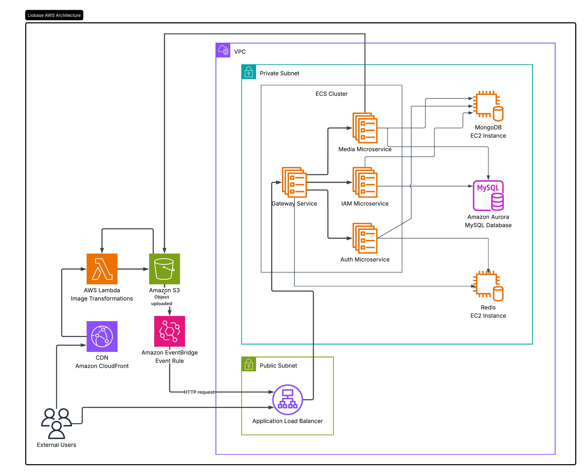

# Liobase — Cloud Asset Transformation Platform

## Overview
Liobase is a microservice-based asset storage and transformation platform built using Go, gRPC, and C++. It provides an on-the-fly asset transformation pipeline where CDN requests trigger AWS Lambda functions to transform and deliver assets with sub-500ms latency. S3 and EventBridge natively handle asynchronous upload confirmations. 

---

## Architecture

The platform relies on AWS ECS with ECS Service Connect for internal discovery. The data and access layers are strictly segregated to ensure optimal performance and security:
*   **Amazon Aurora MySQL**: Stores API keys and object metadata records.
*   **MongoDB**: Manages user profiles and login credentials.
*   **Redis**: Handles high-speed session management.
*   **C++ & OpenCV**: Powers the highly-optimized `image-processor` binary for internal media transformations.

---

## SDK Integration
Liobase features a developer SDK supporting 10+ distinct asset transformation types, enabling fast integrations so your applications can consume and manage user-controlled assets effortlessly.

For full API references, installation guides, and usage examples for our **Node.js SDK**, please visit the official documentation:
> **[docs.liobase.com](https://docs.liobase.com)**

---

## Configuration
To run the services locally or in production, create a `.env` file in the root directory based on the provided `.env.example`. The microservices and databases map to the following default ports:

| Service / Resource | Default Port |
| :--- | :--- |
| **Gateway Service** | `3000` |
| **Auth Service** | `50051` |
| **IAM Service** | `50052` |
| **Media Service** | `50053` |
| **Redis** | `6379` |
| **MongoDB** | `27017` |
| **MySQL** | `3306` |

**Important:** Ensure you safely update the AWS credentials (`AWS_S3_ACCESS_KEY`, `AWS_S3_SECRET_KEY`) and database passwords with your secure values before deployment.

---

## Running the Project
This project utilizes Docker and a `Makefile` to simplify local testing and deployment orchestration. Run the following commands from your terminal to manage the environment:

1.  **Build C++ Processor**: Run `make processor` to compile the OpenCV image transformation binaries.
2.  **Build Test Images**: Run `make build-test` to build local Docker images for all microservices.
3.  **Run Local Environment**: Run `make run-test` to spin up the custom `app-network` and start the Gateway, Auth, IAM, and Media containers in the background.
4.  **Clean Up**: Run `make stop-test` or `make clean-test` to gracefully halt and remove the local Docker containers and networks.